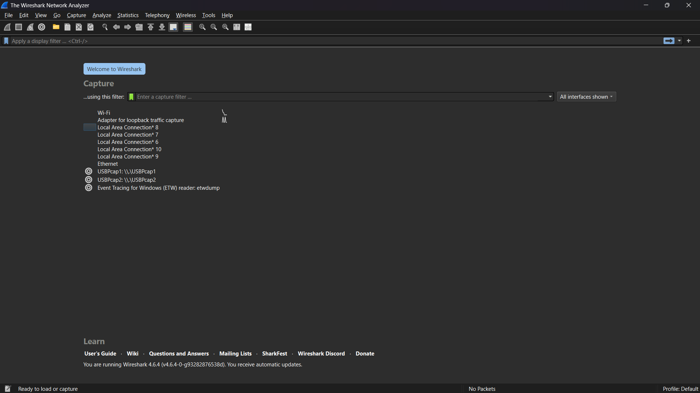
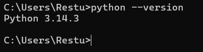

# LAPORAN PRAKTIKUM JARINGAN KOMPUTER- MODUL 1

## Running Modul 

### Identitas
| Item | Keterangan |
|------|------------|
| **Nama** | Restu Fadilah Al Fatah |
| **NIM** | 103072400081 |
| **Kelas** | IF-04-01 |

---

## 1. Persiapan Tools
Sebelum memulai praktikum, dilakukan pengecekan dan instalasi tools yang wajib digunakan selama 16 pertemuan ke depan.

### 1.1 Wireshark
Wireshark adalah aplikasi packet sniffer yang digunakan untuk menganalisis protokol jaringan.
- **Status:** Terinstall ✅
- **Versi:** 4.6.4
- **Link Download:** [www.wireshark.org](http://www.wireshark.org/)

### 1.2 Python
Python digunakan untuk modul Socket Programming.
- **Status:** Terinstall ✅
- **Versi:** 3.13.7
- **Link Download Phyton:** [www.python.org](https://www.python.org/downloads/)

---

## 2. Langkah Kerja
Berikut adalah langkah-langkah yang dilakukan selama praktikum Modul 1:

1. **Briefing Aturan Praktikum**
   - Mendengarkan penjelasan asisten mengenai tata tertib laboratorium.
   - Memahami sistem penilaian, kehadiran (minimal 75%), dan sanksi pelanggaran.
   - Memahami alur 16 modul praktikum hingga Tugas Besar.

2. **Pengecekan Tools**
   - Memastikan Wireshark dan Python sudah terinstall di komputer laboratorium/personal.
   - Melakukan update jika diperlukan.

3. **Test Run Wireshark**
   - Membuka aplikasi Wireshark.
   - Mengamati fitur dasar Wireshark (Packet List, Packet Details, Packet Bytes).

---

## 3. Hasil dan Pembahasan

### 3.1 Tampilan Awal Wireshark
Berikut adalah tampilan awal Wireshark sebelum membuka file trace. Terlihat daftar interface jaringan yang tersedia.

*Gambar 1: Gambar Tersebut Merupakan Tampilan awal Wireshark saat pertama kali dibuka.*

### 3.2 Verifikasi Python
Berikut adalah tangkapan layar Command Prompt/Terminal saat mengecek versi Python untuk memastikan tools siap digunakan pada modul selanjutnya (Modul 7 & 9).

*Gambar 2: Verifikasi instalasi Python melalui command line.*

---

## 4. Kesimpulan
Setelah Menjalani Praktikum modul 1, ini kesimpulannya :
1. Praktikan telah memahami aturan main, sistem penilaian, dan sanksi yang berlaku di Laboratorium Informatika Universitas Telkom.
2. Tools utama yaitu **Wireshark** dan **Python** telah berhasil diinstall dan berfungsi dengan baik.
3. Praktikan mampu memahami antarmuka dasar Wireshark yang akan digunakan pada modul-modul selanjutnya (HTTP, DNS, TCP, dll).
4. Kesiapan tools ini sangat penting untuk kelancaran praktikum hingga penyusunan Tugas Besar.

---