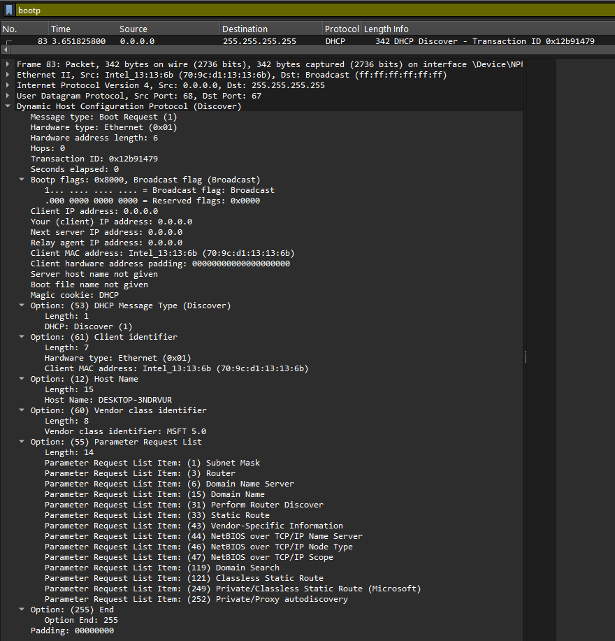
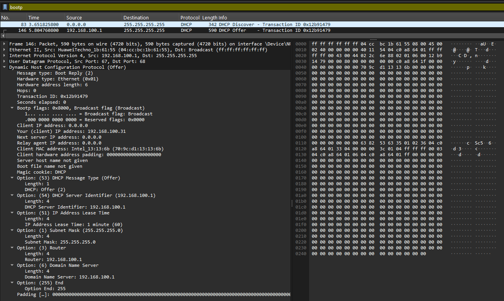

# Laporan Praktikum Jaringan Komputer - Modul 11
## Dynamic Host Configuration Protocol (DHCP)

### Identitas Praktikan
| Item | Keterangan |
|------|-----------|
| **Nama** | Restu Fadilah Al Fatah |
| **NIM** | 103072400081 |
| **Kelas** | IF-04-01 |

---

## 1.1 Tujuan Praktikum
| No | Tujuan                                                   | Penjelasan                                                                                                      |
| -- | -------------------------------------------------------- | --------------------------------------------------------------------------------------------------------------- |
| 1  | Menganalisis paket DHCP menggunakan Wireshark            | Mengamati dan mengidentifikasi paket DHCP yang ditangkap selama proses komunikasi jaringan.                     |
| 2  | Memahami mekanisme DORA                                  | Mempelajari tahapan DHCP yaitu Discover, Offer, Request, dan Acknowledgement dalam proses pemberian alamat IP.  |
| 3  | Mengidentifikasi konfigurasi jaringan dari DHCP Server   | Mengetahui informasi konfigurasi seperti alamat IP, subnet mask, gateway, dan DNS yang diberikan kepada client. |
| 4  | Mendokumentasikan hasil pengamatan dalam format Markdown | Menyajikan tujuan dan hasil praktikum dalam bentuk tabel yang terstruktur menggunakan sintaks Markdown.         |


---

## 1.2 Langkah Praktikum

**Langkah-Langkah Praktikum:**

1. Buka aplikasi **Command Prompt** pada komputer.
2. Jalankan perintah `ipconfig /release` untuk melepaskan alamat IP yang sedang digunakan.
3. Jalankan **Wireshark** dan mulai proses *packet capture* pada interface jaringan yang aktif (Wi-Fi).
4. Jalankan perintah `ipconfig /renew` untuk meminta alamat IP baru dari DHCP server.
5. Setelah alamat IP berhasil diperoleh dan proses DHCP selesai, hentikan penangkapan paket pada Wireshark.
6. Gunakan filter `bootp` untuk menampilkan dan menganalisis paket DHCP yang telah tertangkap.


---

## 1.3 Hasil Praktikum

### 11.3.1 Paket DHCP yang Berhasil Ditangkap

**Filter:** `bootp`


**Tabel Paket DHCP:**

| Frame | Waktu   | Jenis Pesan   | Alamat Sumber  | Alamat Tujuan   | Transaction ID | Keterangan                                                               |
| ----- | ------- | ------------- | -------------- | --------------- | -------------- | ------------------------------------------------------------------------ |
| 83    | 3,65 s  | DHCP Discover | 0.0.0.0        | 255.255.255.255 | 0x12b91479     | Client mencari DHCP server yang tersedia di jaringan.                    |
| 146   | 5,80 s  | DHCP Offer    | 192.168.100.1  | 255.255.255.255 | 0x12b91479     | DHCP server menawarkan alamat IP dan konfigurasi jaringan kepada client. |
| 147   | 5,81 s  | DHCP Request  | 0.0.0.0        | 255.255.255.255 | 0x12b91479     | Client meminta penggunaan alamat IP yang ditawarkan oleh server.         |
| 148   | 5,91 s  | DHCP ACK      | 192.168.100.1  | 255.255.255.255 | 0x12b91479     | Server mengonfirmasi dan memberikan alamat IP kepada client.             |
| 401   | 11,49 s | DHCP Request  | 192.168.100.31 | 192.168.100.1   | 0x1a9df1b3     | Client melakukan pembaruan (renewal) terhadap alamat IP yang dimiliki.   |
| 403   | 11,55 s | DHCP ACK      | 192.168.100.1  | 192.168.100.31  | 0x1a9df1b3     | Server menyetujui permintaan pembaruan alamat IP dari client.            |


**Catatan:**
- Frames 83-148: Proses DORA awal (saat `ipconfig /renew`)
- Frames 401-403: DHCP Request & ACK berikutnya (renewal)
- Transaction ID **0x12b91479** sama untuk 4 paket pertama → satu sesi DHCP

---

### 1.3.2 DHCP Discover (Frame 83)



**Detail Paket:**
```
Message type: Boot Request (1) - Discover
Transaction ID: 0x12b91479
Client MAC address: Intel_13:13:13:6b (70:9c:d1:13:13:6b)
Client IP address: 0.0.0.0 (belum punya IP)

Options:
  (53) DHCP Message Type: Discover (1)
  (61) Client identifier
  (12) Host Name: DESKTOP-3NDRVUR
  (55) Parameter Request List:
    - Subnet Mask (1)
    - Router (3)
    - Domain Name Server (6)
    - Domain Name (15)
    - Dan 10 options lainnya...
```
---

### 1.3.3 DHCP Offer (Frame 146)



**Detail Paket:**
```
Message type: Boot Reply (2) - Offer
Transaction ID: 0x12b91479 (SAMA dengan Discover!)
Your (client) IP address: 192.168.100.31
Next server IP address: 192.168.100.1
Client MAC address: Intel_13:13:13:6b

Options:
  (53) DHCP Message Type: Offer (2)
  (54) DHCP Server Identifier: 192.168.100.1
  (51) IP Address Lease Time: 1 minute (60 seconds)
  (1) Subnet Mask: 255.255.255.0
  (3) Router: 192.168.100.1
  (6) Domain Name Server: 192.168.100.1
```
---

### 1.3.4 DHCP Request (Frame 147)


**Detail Paket:**
```
Message type: Boot Request (3) - Request
Transaction ID: 0x12b91479
Client MAC address: Intel_13:13:13:6b

Options:
  (53) DHCP Message Type: Request (3)
  (50) Requested IP Address: 192.168.100.31
  (54) DHCP Server Identifier: 192.168.100.1
  (12) Host Name: DESKTOP-3NDRVUR
  (55) Parameter Request List:
    - Subnet Mask, Router, DNS, Domain Name, dll
```

**Yang dilakukan client:**
- Menerima tawaran server
- Request IP **192.168.100.31** secara formal
- Pilih server **192.168.100.1**

---

### 1.3.5 DHCP ACK (Frame 148)


**Detail Paket:**
```
Message type: Boot Reply (5) - ACK
Transaction ID: 0x12b91479
Your (client) IP address: 192.168.100.31
Next server IP address: 192.168.100.1

Options:
  (53) DHCP Message Type: ACK (5)
  (54) DHCP Server Identifier: 192.168.100.1
  (51) IP Address Lease Time: 3 days (259200 seconds)
  (1) Subnet Mask: 255.255.255.0
  (3) Router: 192.168.100.1
  (6) Domain Name Server: 192.168.100.1
```

**Catatan menarik:**
- Offer: Lease time 1 menit
- ACK: Lease time 3 hari
- Server mungkin adjust lease time saat finalisasi

---

### 1.3.6 DHCP Renewal (Frames 401 & 403)

**Frame 401 - DHCP Request:**
```
Source: 192.168.100.31 (client sudah punya IP!)
Destination: 192.168.100.1 (unicast ke server)
Transaction ID: 0x1a9df1b3 (ID baru)
Message Type: Request
```

**Frame 403 - DHCP ACK:**
```
Source: 192.168.100.1
Destination: 192.168.100.31 (unicast)
Transaction ID: 0x1a9df1b3
Message Type: ACK
```

---

## 1.4 Analisis Praktikum

### 1.4.1 Proses DORA yang Teramati

```
Waktu 3.65s   : Client kirim DHCP Discover (broadcast)
Waktu 5.80s   : Server balas DHCP Offer (broadcast)
Waktu 5.81s   : Client kirim DHCP Request (broadcast)
Waktu 5.91s   : Server kirim DHCP ACK (broadcast)
─────────────────────────────────────────────────────
Total waktu   : ~2.26 detik (dari Discover ke ACK)

Waktu 11.49s  : Client kirim DHCP Request (unicast)
Waktu 11.55s  : Server balas DHCP ACK (unicast)
─────────────────────────────────────────────────────
Renewal time  : ~0.06 detik (lebih cepat!)
```

**Perbedaan:**
- **Initial DORA:** Broadcast, butuh 4 paket, ~2.26 detik
- **Renewal:** Unicast, cuma 2 paket (Request+ACK), ~0.06 detik

---

### 1.4.2 Konfigurasi Jaringan yang Diberikan

| Parameter           | Nilai                  | Keterangan                                                                            |
| ------------------- | ---------------------- | ------------------------------------------------------------------------------------- |
| **Alamat IP**       | 192.168.100.31         | Alamat yang diberikan DHCP server kepada client untuk berkomunikasi di jaringan.      |
| **Subnet Mask**     | 255.255.255.0          | Menunjukkan bahwa client berada pada jaringan dengan prefix /24.                      |
| **Default Gateway** | 192.168.100.1          | Alamat router yang digunakan sebagai jalur keluar menuju jaringan lain atau internet. |
| **DNS Server**      | 192.168.100.1          | Server yang bertugas menerjemahkan nama domain menjadi alamat IP.                     |
| **Lease Time**      | 259.200 detik (3 hari) | Jangka waktu penggunaan alamat IP sebelum client harus melakukan pembaruan (renewal). |
| **DHCP Server**     | 192.168.100.1          | Server yang bertanggung jawab memberikan konfigurasi jaringan kepada client.          |


---

### 1.4.3 Transaction ID Analysis

**Sesi 1 (Initial DORA):**
```
Frame 83  (Discover): Transaction ID = 0x12b91479
Frame 146 (Offer)   : Transaction ID = 0x12b91479 ✓
Frame 147 (Request) : Transaction ID = 0x12b91479 ✓
Frame 148 (ACK)     : Transaction ID = 0x12b91479 ✓
```

**Sesi 2 (Renewal):**
```
Frame 401 (Request): Transaction ID = 0x1a9df1b3
Frame 403 (ACK)    : Transaction ID = 0x1a9df1b3 ✓
```

**Kesimpulan:**
- Transaction ID sama dalam satu sesi DHCP
- Transaction ID berbeda untuk sesi yang berbeda
- Client generate random Transaction ID

---

### 1.4.4 Broadcast vs Unicast

**Initial DORA (Broadcast):**
```
Discover: 0.0.0.0 → 255.255.255.255 (client belum punya IP)
Offer:    192.168.100.1 → 255.255.255.255 (broadcast)
Request:  0.0.0.0 → 255.255.255.255 (broadcast)
ACK:      192.168.100.1 → 255.255.255.255 (broadcast)
```

**Renewal (Unicast):**
```
Request: 192.168.100.31 → 192.168.100.1 (unicast)
ACK:     192.168.100.1 → 192.168.100.31 (unicast)
```

---

### 1.4.5 Lease Time Analysis

**Dari Wireshark:**
- **Offer:** Lease time = 60 seconds (1 menit)
- **ACK:** Lease time = 259200 seconds (3 hari)

**Mengapa berbeda?**
1. Offer mungkin set lease time minimal sebagai "placeholder"
2. ACK finalisasi dengan lease time sebenarnya (3 hari)
3. Atau server adjust berdasarkan kebijakan

---

### 1.5 Kesimpulan

#### A. Poin-Poin Keberhasilan Praktikum


|  No.  | Aspek Analisis                     | Hasil Pengamatan                                                                                                                                                                                                                                                                                                                  |
| :---: | ---------------------------------- | --------------------------------------------------------------------------------------------------------------------------------------------------------------------------------------------------------------------------------------------------------------------------------------------------------------------------------- |
| **1** | **Penangkapan Paket DHCP**         | Proses penangkapan paket berhasil dilakukan dengan terdeteksinya empat paket utama DHCP (Discover, Offer, Request, dan ACK) serta dua paket tambahan yang digunakan untuk proses pembaruan alamat IP (*renewal*).                                                                                                                 |
| **2** | **Mekanisme DORA**                 | Seluruh tahapan DORA berjalan dengan baik. Client mengirimkan pesan **Discover** untuk mencari DHCP server, server merespons dengan **Offer** yang menawarkan alamat IP `192.168.100.31`, kemudian client mengirim **Request** untuk meminta alamat tersebut, dan server mengirim **ACK** sebagai konfirmasi pemberian alamat IP. |
| **3** | **Transaction ID**                 | Semua paket pada proses DORA awal menggunakan Transaction ID yang sama, yaitu `0x12b91479`, yang menunjukkan bahwa paket-paket tersebut berasal dari sesi DHCP yang sama.                                                                                                                                                         |
| **4** | **Informasi Konfigurasi Jaringan** | Client berhasil memperoleh konfigurasi jaringan secara otomatis, meliputi alamat IP `192.168.100.31`, subnet mask `255.255.255.0`, default gateway `192.168.100.1`, DNS server `192.168.100.1`, serta lease time selama 3 hari.                                                                                                   |
| **5** | **Metode Pengiriman Paket**        | Pada proses DORA awal, komunikasi menggunakan metode **broadcast** karena client belum memiliki alamat IP. Setelah memperoleh alamat IP, proses **renewal** dilakukan menggunakan **unicast**, sehingga komunikasi menjadi lebih efisien.                                                                                         |
| **6** | **Analisis Menggunakan Wireshark** | Wireshark terbukti mampu menampilkan dan menganalisis paket DHCP dengan baik. Penggunaan filter `bootp` memudahkan proses identifikasi dan pengamatan paket DHCP yang relevan.                                                                                                                                                    |


#### B. Temuan Menarik Selama Praktikum


|  No.  | Objek Temuan                           | Hasil Analisis                                                                                                                                                                                                                                                                                                                                 |
| :---: | -------------------------------------- | ---------------------------------------------------------------------------------------------------------------------------------------------------------------------------------------------------------------------------------------------------------------------------------------------------------------------------------------------- |
| **1** | **Lease Time**                         | Ditemukan perbedaan nilai masa sewa (*lease time*) antara paket **DHCP Offer** dan **DHCP ACK**. Pada tahap Offer, lease time yang ditampilkan adalah 1 menit, sedangkan pada tahap ACK berubah menjadi 3 hari. Hal ini menunjukkan bahwa server dapat memperbarui atau menetapkan nilai lease time akhir saat proses alokasi IP dikonfirmasi. |
| **2** | **Performa Proses DHCP**               | Proses **renewal** berlangsung lebih cepat, yaitu sekitar 0,06 detik, dibandingkan proses DORA awal yang memerlukan sekitar 2,26 detik. Perbedaan ini terjadi karena client sudah memiliki alamat IP sehingga komunikasi dilakukan secara **unicast** tanpa perlu melalui tahapan pencarian server secara broadcast.                           |
| **3** | **Konfigurasi Infrastruktur Jaringan** | Alamat **Default Gateway** dan **DNS Server** sama-sama menggunakan IP `192.168.100.1`. Kondisi ini mengindikasikan bahwa satu perangkat jaringan berfungsi ganda sebagai router sekaligus penyedia layanan DNS bagi client dalam jaringan lokal.                                                                                              |


---