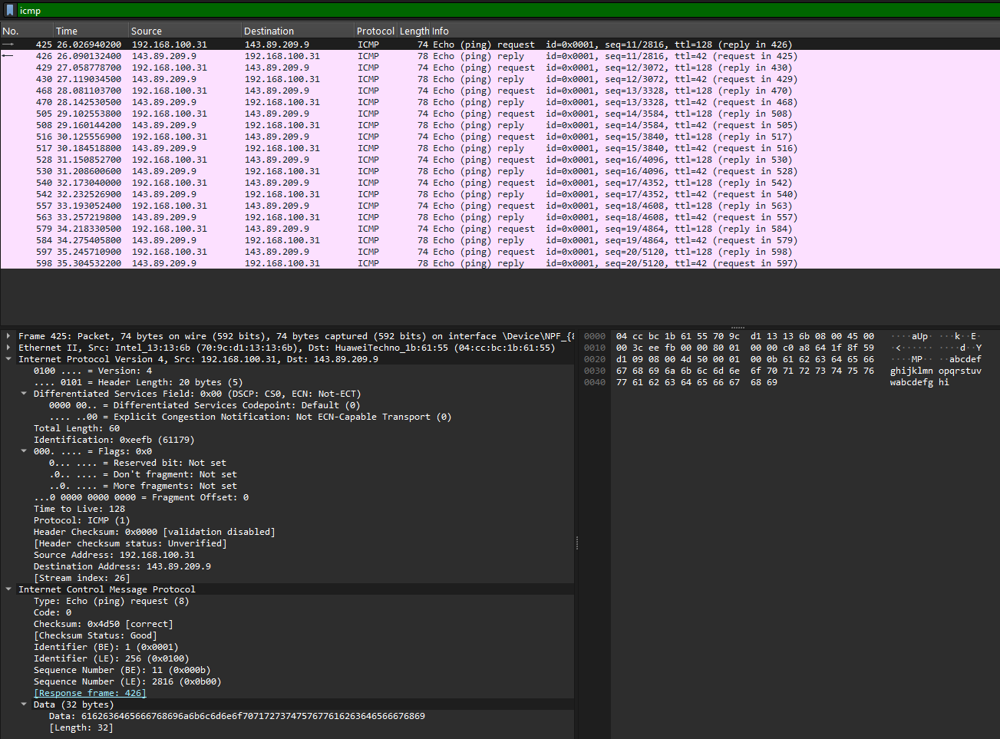
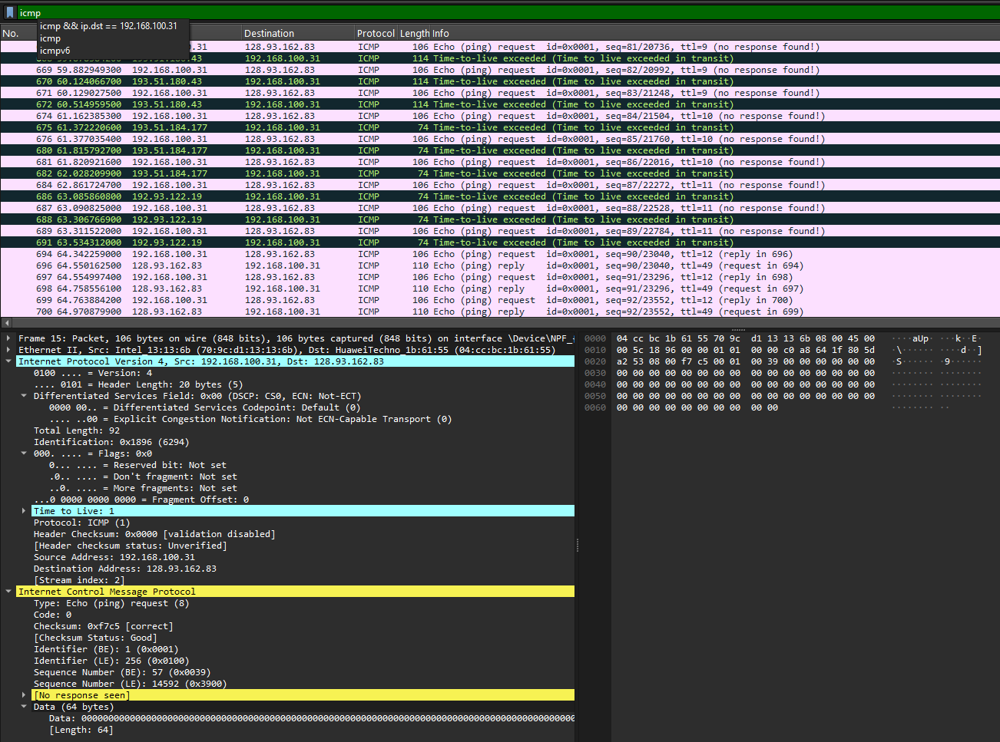

# Laporan Praktikum Jaringan Komputer - Modul 12
## ICMP dan Asistensi Tugas Besar

### Identitas Praktikan
| Item | Keterangan |
|------|------------|
| **Nama** | Restu Fadilah Al Fatah |
| **NIM** | 103072400081 |
| **Kelas** | IF-04-01 |

---


## 1. Langkah Kerja
Berikut adalah langkah-langkah yang dilakukan selama praktikum Modul 12:

### 1.1 ICMP dan Ping
1. Membuka aplikasi **Command Prompt** pada sistem operasi Windows.
2. Menjalankan aplikasi **Wireshark**, kemudian memulai proses *packet capture* pada antarmuka jaringan (*network interface*) yang sedang aktif.
3. Melakukan pengujian konektivitas dengan mengirimkan paket ICMP ke host yang berada di benua lain menggunakan perintah berikut:
   ```cmd
   ping -n 10 www.ust.hk
   ```
   atau
   ```cmd
   c:\windows\system32\ping -n 10 www.ust.hk
   ```
4. Menunggu hingga seluruh 10 paket ICMP berhasil dikirim dan diterima.
5. Menghentikan proses *capture* pada Wireshark setelah pengujian selesai dilakukan.
6. Menampilkan paket ICMP dengan memasukkan filter `icmp` pada kolom filter Wireshark.
7. Mengamati dan menganalisis struktur paket **ICMP Echo Request** serta **ICMP Echo Reply** yang berhasil direkam selama proses pengujian.


### 1.2 ICMP dan Traceroute
1. Membuka aplikasi **Command Prompt** dan menjalankan **Wireshark** pada komputer yang digunakan.
2. Memulai proses *packet capture* pada antarmuka jaringan (*network interface*) yang sedang aktif.
3. Menjalankan perintah **traceroute** untuk melacak jalur paket menuju host tujuan dengan perintah berikut:
   ```cmd
   tracert www.inria.fr
   ```
4. Menunggu hingga proses *traceroute* selesai dan seluruh informasi jalur yang dilalui paket berhasil ditampilkan.
5. Menghentikan proses *capture* pada Wireshark, kemudian menampilkan paket yang berkaitan dengan protokol ICMP menggunakan filter `icmp`.
6. Mengamati serta menganalisis paket **ICMP Time Exceeded** yang dihasilkan oleh router pada setiap hop, serta paket **ICMP Echo Reply** yang diterima dari host tujuan.

---

## 2. Hasil dan Pembahasan

### 2.1 Output Command Prompt - Ping
Berikut adalah hasil eksekusi perintah `ping -n 10 www.ust.hk`:


*Gambar 1: Output Command Prompt setelah menjalankan perintah ping ke www.ust.hk.*

Berdasarkan hasil pengujian *ping* terhadap host tujuan, diperoleh hasil analisis sebagai berikut:

| Parameter Pengujian               | Hasil Pengamatan | Analisis dan Kesimpulan                                                                                                                                        |
| --------------------------------- | ---------------- | -------------------------------------------------------------------------------------------------------------------------------------------------------------- |
| **Paket Terkirim (Echo Request)** | 10 paket         | Seluruh paket ICMP Echo Request berhasil dikirim menuju host tujuan tanpa kendala.                                                                             |
| **Paket Diterima (Echo Reply)**   | 10 paket         | Semua paket yang dikirim memperoleh balasan dari server tujuan, menunjukkan konektivitas yang baik.                                                            |
| **Packet Loss**                   | 0%               | Tidak terdapat paket yang hilang selama proses komunikasi, sehingga koneksi jaringan dapat dikategorikan sangat stabil dan andal.                              |
| **RTT Minimum**                   | 52 ms            | Menunjukkan waktu tempuh tercepat yang dibutuhkan paket untuk melakukan perjalanan pulang-pergi ke server tujuan.                                              |
| **RTT Maksimum**                  | 69 ms            | Menunjukkan waktu tempuh terlama yang dialami paket selama proses pengujian.                                                                                   |
| **RTT Rata-rata**                 | 64 ms            | Mengindikasikan performa jaringan yang baik dengan tingkat latensi yang relatif rendah untuk komunikasi internasional.                                         |
| **TTL (Time to Live)**            | 43               | Menunjukkan paket telah melewati sejumlah router sebelum mencapai tujuan. Dengan asumsi TTL awal sebesar 128, paket diperkirakan telah melalui sekitar 85 hop. |

Berdasarkan hasil tersebut, dapat disimpulkan bahwa koneksi jaringan yang digunakan memiliki kualitas yang baik, ditunjukkan oleh tidak adanya kehilangan paket, waktu respons yang relatif rendah, serta keberhasilan seluruh paket dalam mencapai host tujuan dan memperoleh balasan.


### 2.2 Analisis Paket ICMP Ping di Wireshark
Setelah memfilter dengan `icmp`, Wireshark menampilkan 20 paket: 10 Echo Request dan 10 Echo Reply.


*Gambar 2: Daftar paket ICMP hasil capture ping di Wireshark.*

#### Detail Paket Echo Request (Tipe 8, Kode 0)
| Field | Nilai | Keterangan |
|-------|-------|-----------|
| **Type** | **8** | Echo Request |
| **Code** | **0** | - |
| **Checksum** | **0x4d50** | Status: Good/Correct |
| **Identifier (BE)** | **1 (0x0001)** | Big Endian |
| **Identifier (LE)** | **256 (0x0100)** | Little Endian |
| **Sequence Number (BE)** | **11 (0x000b)** | Urutan paket ke-11 |
| **Sequence Number (LE)** | **2816 (0x0b00)** | Little Endian |
| **Data Length** | **32 bytes** | Payload: "abcdefghijklmnop..." |

#### Detail Paket Echo Reply (Tipe 0, Kode 0)

*Gambar 4: Struktur paket ICMP Echo Reply yang diperluas.*

### Analisis Paket ICMP Echo Reply

Berdasarkan hasil pengamatan pada Wireshark, diperoleh informasi paket **ICMP Echo Reply** sebagai berikut:

| Field                               | Nilai             | Keterangan                                                                    |
| ----------------------------------- | ----------------- | ----------------------------------------------------------------------------- |
| **Type**                            | **0**             | Menunjukkan bahwa paket merupakan ICMP Echo Reply (balasan dari host tujuan). |
| **Code**                            | **0**             | Tidak terdapat kode tambahan untuk jenis pesan ini.                           |
| **Checksum**                        | **0x5550**        | Nilai checksum valid dan berhasil diverifikasi oleh Wireshark.                |
| **Identifier (Big Endian)**         | **1 (0x0001)**    | Digunakan untuk mengidentifikasi sesi komunikasi ICMP.                        |
| **Identifier (Little Endian)**      | **256 (0x0100)**  | Representasi nilai identifier dalam format Little Endian.                     |
| **Sequence Number (Big Endian)**    | **11 (0x000b)**   | Menunjukkan urutan paket ICMP yang dikirim dan diterima.                      |
| **Sequence Number (Little Endian)** | **2816 (0x0b00)** | Representasi sequence number dalam format Little Endian.                      |

Perbedaan utama antara **ICMP Echo Request** dan **ICMP Echo Reply** terletak pada nilai field **Type**. Pada Echo Request, nilai Type adalah **8**, sedangkan pada Echo Reply nilainya **0**, yang menandakan bahwa paket tersebut merupakan respons dari host tujuan terhadap permintaan yang diterima sebelumnya.

#### Hasil Analisis Capture Wireshark

| Parameter Analisis      | Hasil Pengamatan          | Interpretasi                                                                           |
| ----------------------- | ------------------------- | -------------------------------------------------------------------------------------- |
| **Jumlah Paket ICMP**   | 20 paket                  | Terdiri atas 10 paket Echo Request dan 10 paket Echo Reply.                            |
| **Rentang Frame**       | Frame 425–598             | Paket ICMP yang diamati berada pada rentang frame tersebut.                            |
| **Pola Komunikasi**     | Request–Reply berpasangan | Setiap Echo Request memperoleh satu Echo Reply sebagai respons.                        |
| **Sequence Number**     | 11–20                     | Menunjukkan urutan paket yang dikirim selama proses pengujian.                         |
| **Response Time**       | 40–65 ms                  | Waktu respons relatif stabil dan menunjukkan kualitas jaringan yang baik.              |
| **Packet Loss**         | 0%                        | Tidak ditemukan kehilangan paket selama proses pengujian berlangsung.                  |
| **Source Address**      | 143.89.209.9              | Alamat IP host tujuan (*[www.ust.hk](http://www.ust.hk)*) yang mengirimkan Echo Reply. |
| **Destination Address** | 192.168.100.31            | Alamat IP perangkat lokal yang menerima balasan dari host tujuan.                      |

Berdasarkan hasil analisis tersebut, dapat disimpulkan bahwa komunikasi ICMP berlangsung dengan baik. Seluruh paket permintaan memperoleh balasan dari host tujuan, tidak ditemukan kehilangan paket, serta waktu respons yang relatif konsisten. Kondisi ini menunjukkan bahwa koneksi jaringan menuju server tujuan berada dalam keadaan stabil dan memiliki performa yang baik.


### 2.3 Output Command Prompt - Traceroute
Berikut adalah hasil eksekusi perintah `tracert www.inria.fr`:


*Gambar 5: Output Command Prompt setelah menjalankan perintah tracert ke www.inria.fr.*

Dari gambar di atas:
| Parameter Pelacakan | Hasil Pengamatan | Penjelasan Mekanis & Keamanan Jaringan |
| :--- | :--- | :--- |
| **Total Lompatan (*Hops*)** | **12 hops** | Paket data melewati 11 perangkat perantara sebelum tiba di host tujuan akhir. |
| **Paket Probe per Hop** | **3 Paket** | Setiap simpul router diuji sebanyak 3 kali secara berkala menggunakan peningkatan nilai TTL (1, 2, 3, dst.). |
| **Respon Mayoritas Hop** | **ICMP Time Exceeded**<br>(Type 11, Code 0) | Router perantara sengaja membuang paket karena TTL mencapai nilai 0, lalu mengirimkan pesan galat ini kembali ke pengirim. |
| **Hop Akhir (Hop 12)** | `prod-inriafr-cms.inria.fr`<br>[**128.93.162.83**] | Server target utama berhasil dicapai dan merespon balik menggunakan pesan **ICMP Echo Reply** (Type 0, Code 0). |
Use code with caution.

**Network Path Analysis:**
```
Hop 1:   192.168.100.1           (Local Gateway)
Hop 2:   10.114.0.1              (ISP Network)
Hop 3-7: 180.240.x.x, 180.250.x  (ISP Network - Indonesia)
Hop 8:   37.49.236.19            (RENATER - France International Gateway)
Hop 9-10: 193.51.180.43          (RENATER Network - France)
Hop 11:  192.93.122.19           (INRIA Network)
Hop 12:  128.93.162.83           (Destination - inria.fr)
```

### 2.4 Analisis Paket ICMP Traceroute di Wireshark

*Gambar 6: Paket ICMP Time Exceeded hasil capture traceroute.*

#### Detail Paket ICMP Time Exceeded (Tipe 11, Kode 0)

*Gambar 7: Struktur paket ICMP Time Exceeded yang diperluas.*

| Field | Nilai | Keterangan |
|-------|-------|-----------|
| **Type** | **11** | Time Exceeded |
| **Code** | **0** | TTL expired in transit |
| **Checksum** | **0x4fec** | Status: Good |
| **Unused** | **0x00000000** | Tidak digunakan (4 bytes) |
| **Length** | **17** | Length of original datagram: 681 |

**Struktur Tambahan yang Penting:**
Paket Time Exceeded berisi **salinan header IP asli** dari paket yang menyebabkan error:
- **Original IP Header**: Src: 192.168.100.31, Dst: 128.93.162.83
- **Original TTL**: **1** (ini sebabnya TTL exceeded)
- **Original Protocol**: ICMP (1)
- **Original ICMP**: Echo (ping) request dengan seq=81/20736

**Analisis Paket Traceroute di Wireshark:**
- Multiple hops dengan TTL berbeda: 1, 9, 10, 11, 12
- Router merespons dengan **Type 11 Code 0**
- Beberapa hop tidak merespons ("no response found!")
- Hop yang berhasil: **192.51.180.43**, **192.93.122.19**
- Final destination: **128.93.162.83** (www.inria.fr - Perancis)

---

## 3. Pembahasan 

### 3.1 Perbandingan Fungsional Mekanisme ICMP (Ping vs Traceroute)

### Perbandingan Penggunaan ICMP pada Ping dan Traceroute

| Karakteristik                        | ICMP Ping (Pengujian Konektivitas *End-to-End*)                                                                                                                           | ICMP Traceroute (Pemetaan Jalur dan *Hop*)                                                                                                                           |
| ------------------------------------ | ------------------------------------------------------------------------------------------------------------------------------------------------------------------------- | -------------------------------------------------------------------------------------------------------------------------------------------------------------------- |
| **Jenis Pesan ICMP yang Digunakan**  | Menggunakan paket **ICMP Echo Request (Type 8)** dan **ICMP Echo Reply (Type 0)** untuk menguji konektivitas antara host sumber dan tujuan.                               | Menggunakan **ICMP Echo Request (Type 8)** dengan nilai TTL yang berubah secara bertahap, serta menerima **ICMP Time Exceeded (Type 11)** dari router yang dilewati. |
| **Pengelolaan TTL (*Time to Live*)** | Nilai TTL dikirim menggunakan nilai bawaan sistem operasi dan tidak diubah selama proses pengujian.                                                                       | Nilai TTL dinaikkan secara bertahap (1, 2, 3, dan seterusnya) untuk mengidentifikasi setiap router yang dilewati paket.                                              |
| **Fungsi Utama**                     | Digunakan untuk mengukur waktu tempuh bolak-balik (*Round Trip Time/RTT*) serta mengevaluasi keberhasilan komunikasi dengan host tujuan.                                  | Digunakan untuk memetakan jalur komunikasi dan mengidentifikasi alamat IP maupun performa setiap *hop* yang dilalui paket menuju tujuan akhir.                       |
| **Hasil Pengamatan**                 | Pengujian berhasil mencapai server tujuan di Hong Kong dengan nilai RTT berkisar antara **57 ms hingga 104 ms**, yang menunjukkan koneksi jaringan berfungsi dengan baik. | Pengujian berhasil mengidentifikasi jalur komunikasi menuju server di Prancis dengan total **12 hop**, sehingga struktur rute jaringan dapat diamati secara detail.  |

Berdasarkan hasil pengujian, dapat disimpulkan bahwa utilitas **Ping** lebih berfokus pada pengukuran kualitas koneksi dan waktu respons antara dua host, sedangkan **Traceroute** digunakan untuk menelusuri jalur yang dilalui paket serta mengidentifikasi router-router yang terlibat dalam proses pengiriman data. Kedua metode sama-sama memanfaatkan protokol ICMP, namun memiliki tujuan dan mekanisme penggunaan yang berbeda.


### 3.2 Analisis Kuantitatif Performa, Nilai TTL, dan Packet Loss

### Perbandingan Analisis Hasil Ping dan Traceroute

| Parameter Analisis                | Hasil Pengujian Ping (`www.ust.hk`)                                                                                                                                                                                                                                                                   | Hasil Pengujian Traceroute (`www.inria.fr`)                                                                                                                                                                                                                                                                                                                                   |
| --------------------------------- | ----------------------------------------------------------------------------------------------------------------------------------------------------------------------------------------------------------------------------------------------------------------------------------------------------- | ----------------------------------------------------------------------------------------------------------------------------------------------------------------------------------------------------------------------------------------------------------------------------------------------------------------------------------------------------------------------------- |
| **Evaluasi Performa Jaringan**    | **Sangat Baik dan Stabil**. Nilai RTT rata-rata sebesar **64 ms** menunjukkan latensi yang relatif rendah untuk komunikasi internasional. Selain itu, selisih antara RTT minimum dan maksimum tidak terlalu besar, sehingga variasi waktu tunda (*jitter*) dapat dikategorikan rendah.                | **Sesuai untuk Komunikasi Jarak Jauh**. Berdasarkan jalur yang teridentifikasi, waktu tempuh paket pada komunikasi lintas benua diperkirakan berada pada rentang **200–400 ms**. Nilai tersebut masih tergolong normal mengingat jarak geografis yang cukup jauh antara sumber dan tujuan.                                                                                    |
| **Analisis TTL (*Time to Live*)** | Nilai TTL yang diterima sebesar **43** menunjukkan bahwa paket masih memiliki sisa TTL ketika tiba di host tujuan. Dengan asumsi TTL awal sebesar **128**, maka diperoleh perhitungan **128 − 43 = 85**, yang mengindikasikan paket telah melewati sekitar **85 hop/router** sebelum mencapai tujuan. | Pada proses traceroute, nilai TTL tidak bersifat tetap, melainkan dinaikkan secara bertahap mulai dari **1, 2, 3, dan seterusnya**. Setiap router yang dilewati akan mengurangi nilai TTL sebesar satu. Ketika TTL mencapai nol, router akan mengirimkan pesan **ICMP Time Exceeded**, sehingga jalur komunikasi dapat dipetakan secara bertahap hingga mencapai host tujuan. |

Berdasarkan hasil evaluasi, pengujian **Ping** memberikan informasi mengenai kualitas koneksi, tingkat keterlambatan (*latency*), dan keberhasilan komunikasi dengan host tujuan. Sementara itu, **Traceroute** berfungsi untuk mengidentifikasi jalur yang dilalui paket dan menganalisis karakteristik setiap *hop* yang terlibat dalam proses pengiriman data. Kombinasi kedua metode tersebut memberikan gambaran yang lebih lengkap mengenai performa dan struktur jaringan yang digunakan.
