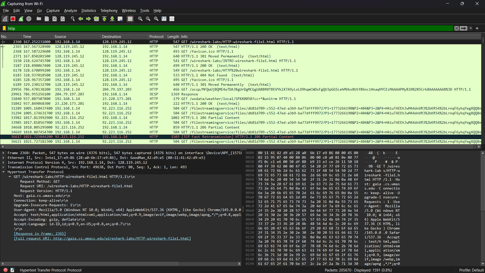
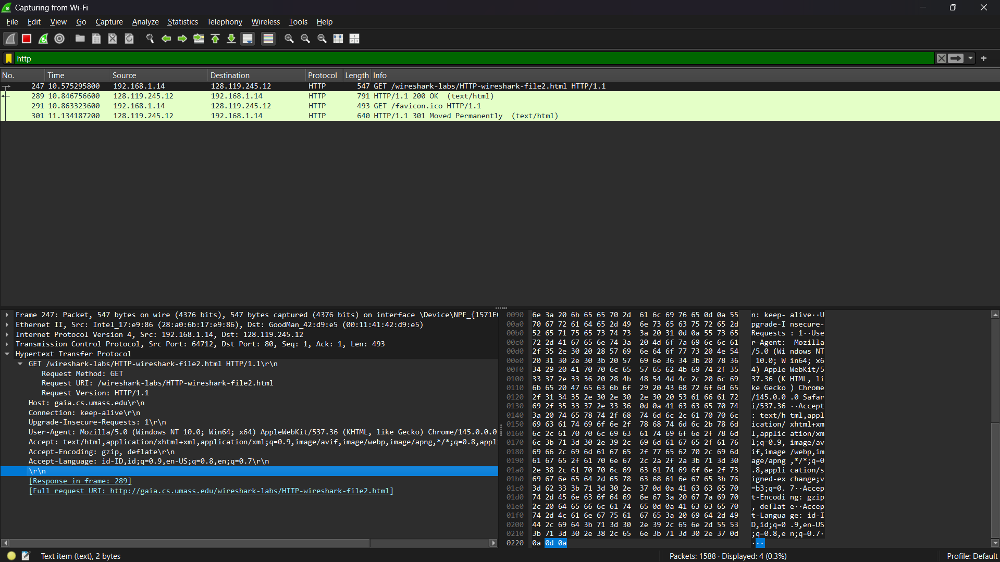
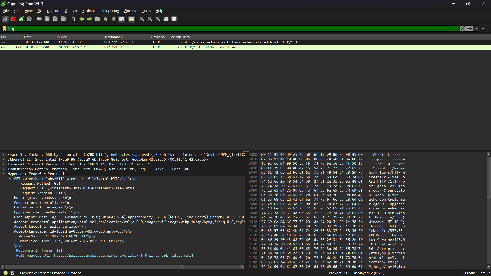
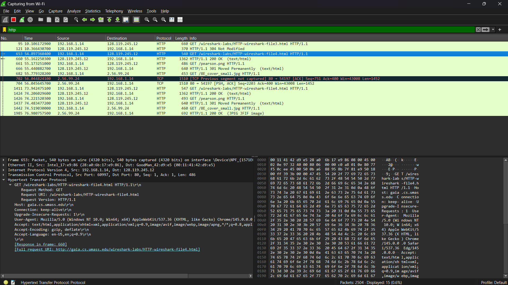
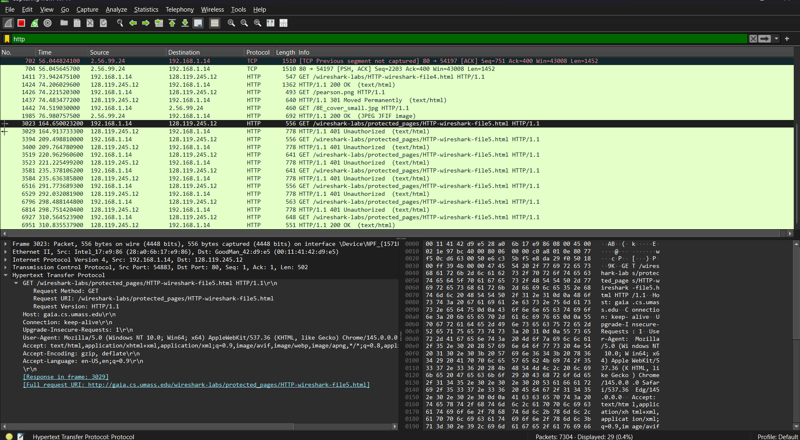

# LAPORAN PRAKTIKUM JARINGAN KOMPUTER - Modul 3
## HTTP Protocol Analysis

> **Semester Genap 2025/2026 | Fakultas Informatika | Universitas Telkom**

---

### Identitas Praktikan
| Item | Keterangan |
|------|------------|
| **Nama** | Restu Fadilah Al Fatah |
| **NIM** | 103072400081 |
| **Kelas** | IF-04-01 |

---

# 1. Dasar Teori

| Aspek | Deskripsi Singkat |
|-------|------------------|
| **Basic GET/Response** | Proses komunikasi paling dasar: client mengirim permintaan dokumen ke server, lalu server memberikan respon dengan kode status Misal : 200 OK. |
| **Conditional GET** | Teknik penyimpanan cache menggunakan header If-Modified-Since; server akan mengirim 304 Not Modified apabila file tidak mengalami perubahan. |
| **HTTP & TCP** | Saat dokumen berukuran besar dikirim, data tersebut dibagi menjadi beberapa bagian kecil berupa segmen TCP sebelum diteruskan ke client. |
| **Embedded Objects** | Sebuah halaman HTML yang berisi gambar atau elemen tambahan akan menyebabkan browser melakukan beberapa HTTP GET Requests  secara terpisah. |
| **HTTP Authentication** | KInformasi login dikirim melalui header Authorization: Basic yang telah dikodekan menggunakan Base64. |

---

## 3. Langkah Pengerjaan

### 3.1 Ringkasan Prosedur per Skenario

a. Basic GET
URL Target: .../HTTP-wireshark-file1.html
Key Step : Clear cache → mulai capture → akses URL → stop capture.
Output yang Diharapkan: Muncul paket HTTP GET dari client dan response 200 OK dari server.

b. Conditional GET
URL Target: .../HTTP-wireshark-file2.html
Key Step : Akses halaman dua kali (refresh) lalu analisis header pada request kedua.
Output yang Diharapkan: Terdapat header If-Modified-Since dan server merespons dengan status 304 Not Modified.

c. Long Document
URL Target: .../HTTP-wireshark-file3.html
Key Step : Akses dokumen berukuran besar (sekitar 4500 byte).
Output yang Diharapkan: Paket TCP akan terpecah dan terlihat indikator [TCP segment of a reassembled PDU] di Wireshark.

d. Embedded Objects
URL Target: .../HTTP-wireshark-file4.html
Key Step : Akses halaman yang memiliki dua gambar di dalamnya.
Output yang Diharapkan: Terlihat beberapa request GET (untuk file HTML dan untuk masing-masing gambar).

e. Authentication
URL Target: .../protected_pages/HTTP-wireshark-file5.html
Key Step : Login menggunakan username wireshark-students dan password network.
Output yang Diharapkan: Terdapat header Authorization: Basic pada request HTTP.

### 3.2 Kredensial Autentikasi

| Parameter | Nilai |
|-----------|-------|
| **Username** | `wireshark-students` |
| **Password** | `network` |
| **Encoding** | Base64 |
| **Header Format** | `Authorization: Basic <encoded_string>` |

---

## 4. Hasil dan Pembahasan

### 4.1 Basic HTTP GET/Response

  
*Gambar 1: Tangkapan paket HTTP GET dan Response 200 OK.*

| Field | Nilai pada Request | Nilai pada Response |
|-------|-------------------|-------------------|
| Method/Status | `GET` | `200 OK` |
| Host/Server | `gaia.cs.umass.edu` | `Apache/2.4.41` |
| Content-Type | `text/html, application/xhtml+xml` | `text/html; charset=ISO-8859-1` |

---

### 4.2 HTTP Conditional GET

  
*Gambar 2: Header If-Modified-Since dan respons 304 Not Modified.*

| Percobaan | Header Khusus | Status Code | Keterangan |
|-----------|--------------|-------------|------------|
| Akses Pertama | - | `200 OK` | Server mengirim full konten |
| Akses Kedua (Refresh) | `If-Modified-Since: ...` | `301 Moved Permanently` | Konten tidak berubah, browser pakai cache |

---

### 4.3 Retrieving Long Documents

  
*Gambar 3: TCP segmentation untuk dokumen besar.*

**Analisis:**
- Respons HTTP tidak muat dalam satu paket TCP.
- Wireshark menampilkan keterangan `[TCP segment of a reassembled PDU]`.
- Ini menunjukkan bahwa lapisan transportasi (TCP) memecah data besar menjadi segmen-segmen kecil sebelum dikirim.

---

### 4.4 HTML Documents dengan Embedded Objects

  
*Gambar 4: Multiple HTTP GET requests untuk HTML + gambar.*

| Resource | Server | Method | Status |
|----------|--------|--------|--------|
| `file4.html` | gaia.cs.umass.edu | GET | 200 OK |
| `pearson.png` | gaia.cs.umass.edu | GET | 200 OK |
| `8E_cover_small.jpg` | caite.cs.umass.edu | GET | 200 OK |

---

### 4.5 HTTP Authentication

  
*Gambar 5: Header Authorization: Basic dengan Base64 encoding.*

| Tahap | Request | Response Server |
|-------|---------|----------------|
| 1 (tanpa auth) | `GET /protected/...` | `401 Authorization Required` |
| 2 (dengan auth) | `GET ... + Authorization: Basic ...` | `200 OK + konten halaman` |

---

## 5. Kesimpulan

1. Wireshark efektif untuk analisis HTTP
Wireshark dapat digunakan untuk memantau dan menganalisis komunikasi HTTP secara langsung, sehingga pengguna dapat melihat header, method, dan status code yang dikirim antara client dan server.

2. HTTP bersifat stateless dan mendukung caching
HTTP tidak menyimpan status antar permintaan, namun memiliki mekanisme caching seperti Conditional GET yang membantu meningkatkan efisiensi pertukaran data tanpa mengubah logika aplikasi.

3. TCP menangani fragmentasi data berukuran besar
Saat data yang dikirim cukup besar, protokol TCP secara otomatis membaginya menjadi beberapa segmen sehingga developer tidak perlu mengatur pemecahan data secara manual.

4. Embedded objects menyebabkan beberapa request
Jika sebuah halaman web memiliki objek tambahan seperti gambar atau file lain, browser akan mengirim beberapa request HTTP untuk mengambil setiap objek tersebut agar halaman dapat ditampilkan secara lengkap.

5. HTTP Basic Authentication tidak aman tanpa HTTPS
Metode autentikasi Basic menggunakan encoding Base64 yang mudah didekode, sehingga data login berisiko disadap jika tidak menggunakan enkripsi HTTPS atau TLS.

---