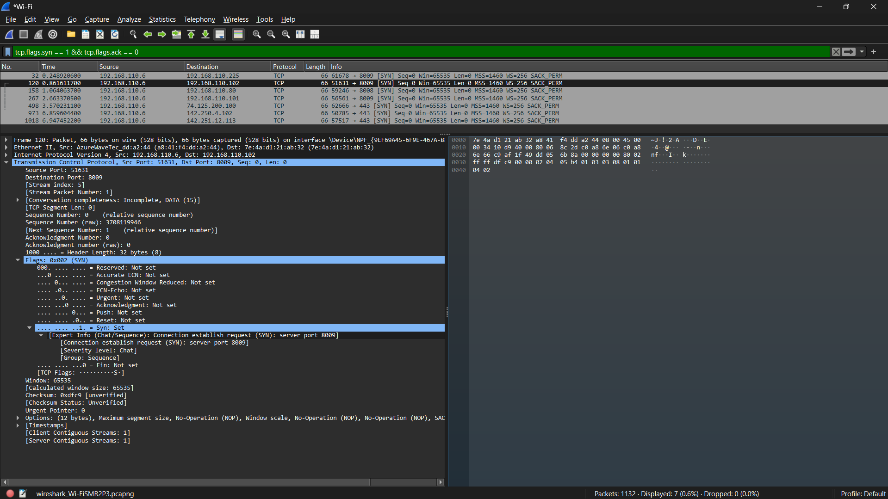
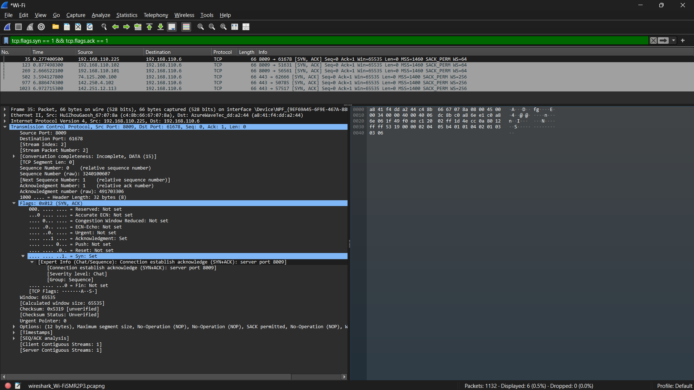
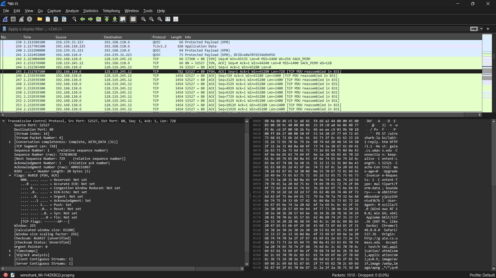

# **LAPORAN PRAKTIKUM JARINGAN KOMPUTER - MODUL 6**
## **Transmission Control Protocol (TCP) Analysis**

### **Identitas Mahasiswa**
**Nama:** Restu Fadilah Al Fatah  
**NIM:** 103072400081  
**Kelas:** IF - 04 - 01

---

## A. Tujuan Praktikum
1. Dapat menginvestigasi cara kerja protokol TCP menggunakan Wireshark

---

## B. Pengantar
Praktikum ini dilakukan untuk memahami cara kerja protokol TCP melalui analisis jejak (trace) segmen TCP selama proses pengiriman file berukuran 150 KB dari komputer ke server jarak jauh. File yang ditransfer berisi teks ASCII dari novel *Alice's Adventures in Wonderland* karya Lewis Carroll. Analisis difokuskan pada nomor urut (sequence number), acknowledgement, mekanisme congestion control TCP seperti *slow start* dan *congestion avoidance*, *flow control*, serta evaluasi performa koneksi berdasarkan *throughput* dan *round-trip time* (RTT).

---

## C. Langkah Praktikum
1. Unduh file teks ASCII *Alice in Wonderland* dari situs yang telah disediakan dan simpan pada komputer.
2. Buka halaman praktikum TCP Wireshark melalui browser.
3. Pilih file yang telah diunduh menggunakan tombol **Browse**.
4. Jalankan aplikasi Wireshark, kemudian mulai proses **packet capture**.
5. Unggah file *alice.txt* ke server dengan menekan tombol **Upload file alice.txt** pada halaman web.
6. Setelah proses unggah selesai dan muncul pesan konfirmasi, hentikan penangkapan paket pada Wireshark.

---

## D. Hasil dan Pembahasan
### 1. Tampilan Awal pada Captured Trace

**Pembahasan Soal dan Jawaban**  
a. Berapa alamat IP dan nomor port TCP yang digunakan oleh komputer klien (sumber) untuk mentransfer file ke gaia.cs.umass.edu?
> Alamat IP klien (sumber) adalah 192.168.110.6.  
> Nomor port TCP yang digunakan adalah 60064.

b. Apa alamat IP dari gaia.cs.umass.edu? Pada nomor port berapa ia mengirim dan menerima segmen TCP untuk koneksi ini?
> Alamat IP dari server adalah 128.119.245.12.
> Server mengirim dan menerima segmen TCP pada port 80.

c. Berapa alamat IP dan nomor port TCP yang digunakan oleh komputer klien Anda (sumber) untuk mentransfer ke gaia.cs.umass.edu?
> IP sumber: 192.168.110.6, Port: 60064.

### 2. Dasar TCP

**Pembahasan Soal dan Jawaban**  
a. Berapa nomor urut segmen TCP SYN yang digunakan untuk memulai sambungan TCP antara komputer klien dan gaia.cs.umass.edu? Apa yang dimiliki segmen tersebut sehingga teridentifikasi sebagai segmen SYN?
> - Nomor urut (Sequence Number) segmen SYN adalah 0 secara relatif, atau 3708119946 (raw).  
> - Segmen ini teridentifikasi sebagai SYN karena pada bagian Flags (0x002), bit Syn di-set menjadi 1, sedangkan flag lainnya tidak.

b. Berapa nomor urut segmen SYNACK yang dikirim oleh gaia.cs.umass.edu ke komputer klien sebagai balasan dari SYN? Berapa nilai dari field Acknowledgement pada segmen SYNACK? Bagaimana gaia.cs.umass.edu menentukan nilai tersebut? Apa yang dimiliki oleh segmen sehingga teridentifikasi sebagai segmen SYNACK?
> - Nomor urut (Sequence Number) segmen SYNACK adalah 0.
> - Nilai field Acknowledgement adalah 1 atau 3708119947.
> - Nilai tersebut ditentukan dengan menambahkan 1 pada raw sequence number dari paket SYN klien sebelumnya (3708119946 + 1).
> - Segmen teridentifikasi sebagai SYNACK karena pada bagian Flags (0x012), bit Acknowledgment dan Syn keduanya di-set menjadi 1.

c. Berapa nomor urut segmen TCP yang berisi perintah HTTP POST?
> Nomor urut (Sequence Number) paket HTTP POST adalah 1 secara relatif, atau 3210585950.

d. Berapa nomor urut dari enam segmen pertama dalam TCP (termasuk segmen HTTP POST)? Pada jam berapa setiap segmen dikirim?
> Dari daftar paket (paket nomor 245 hingga 250), berikut adalah nomor urut (Sequence Number) dan waktu pengiriman (Time) untuk 6 segmen data pertama:
> - Segmen 1 (HTTP POST): Seq = 1. Dikirim pada waktu 2.232787500.
> - Segmen 2: Seq = 729. Dikirim pada waktu 2.232939300.
> - Segmen 3: Seq = 2129. Dikirim pada waktu 2.232939300.
> - Segmen 4: Seq = 3529. Dikirim pada waktu 2.232939300.
> - Segmen 5: Seq = 4929. Dikirim pada waktu 2.232939300.
> - Segmen 6: Seq = 6329. Dikirim pada waktu 2.232939300.

e. Berapa panjang setiap enam segmen TCP pertama?
> Dilihat dari kolom Length (sebagai payload TCP / Len di kolom info), panjang dari enam segmen pertama adalah:
> - Segmen 1: 728 bytes
> - Segmen 2: 1400 bytes
> - Segmen 3: 1400 bytes
> - Segmen 4: 1400 bytes
> - Segmen 5: 1400 bytes
> - Segmen 6: 1400 bytes

f. Berapa jumlah minimum ruang buffer tersedia yang disarankan kepada penerima dan diterima untuk seluruh trace? Apakah kurangnya ruang buffer penerima pernah menghambat pengiriman?
> Penawaran buffer (Window Size) awal dari pihak Server (penerima data) pada paket nomor 243 (SYN, ACK). Nilai ruang buffernya adalah Win=64240.

g. Apakah ada segmen yang ditransmisikan ulang dalam file trace?
> Tidak terlihat adanya segmen yang ditransmisikan ulang (biasanya ditandai dengan sorotan warna hitam/merah dengan teks [TCP Retransmission]).

h. Berapa banyak data yang biasanya diakui oleh penerima dalam ACK? Dapatkah anda mengidentifikasi kasus-kasus di mana penerima melakukan ACK untuk setiap segmen yang diterima?
> Sama seperti RTT di nomor 4, jawaban untuk nomor 8 (pola Acknowledgment dari penerima).

i. Berapa throughput (byte yang ditransfer per satuan waktu) untuk sambungan TCP? Jelaskan bagaimana Anda menghitung nilai ini.
> Berdasarkan statistik Conversations dari rekaman Wireshark, throughput rata-rata untuk sambungan TCP (dari klien ke server) tercatat sebesar 630 kbps (kilo-bits per second).  
> Rumus dasarnya adalah:$$\text{Throughput} = \frac{\text{Total Data}}{\text{Durasi Waktu}}$$Jika kita hitung secara manual menjadi bit per detik (bps):$$\text{Throughput} = \frac{159 \times 1024 \times 8 \text{ bits}}{2.020576 \text{ s}} \approx 644.705 \text{ bits/s} \approx 644 \text{ kbps}$$

### 3. Congestion Control pada TCP

**Pembahasan Soal dan Jawaban**  
a. Dapatkah Anda mengidentifikasi di mana fase “slow start” TCP dimulai dan berakhir, dan pada bagian mana algoritma ”congestion avoidance” mengambil alih? Berikan komentar tentang bagaimana data yang diukur berbeda dari perilaku ideal TCP yang telah kita pelajari.
> - Berdasarkan grafik Sequence Numbers (Stevens) yang diperoleh, fase slow start TCP mulai terlihat pada sekitar detik ke-45 ms dan berakhir di sekitar 65 ms. Fase ini ditandai dengan peningkatan nilai sequence number yang sangat cepat, dari 0 byte hingga sekitar 8,5 kB dalam waktu singkat, menunjukkan pola pertumbuhan yang bersifat eksponensial.
> - fase congestion avoidance tidak tampak secara jelas pada grafik. Kondisi ini kemungkinan disebabkan oleh ukuran file yang relatif kecil sehingga proses pengiriman data telah selesai sebelum koneksi mencapai nilai ssthresh. Akibatnya, TCP tidak sempat beralih ke pola pertumbuhan linear yang menjadi ciri fase congestion avoidance. Oleh karena itu, hasil pengamatan sedikit berbeda dari perilaku ideal TCP yang biasanya memperlihatkan transisi yang jelas antara fase slow start dan congestion avoidance.

---