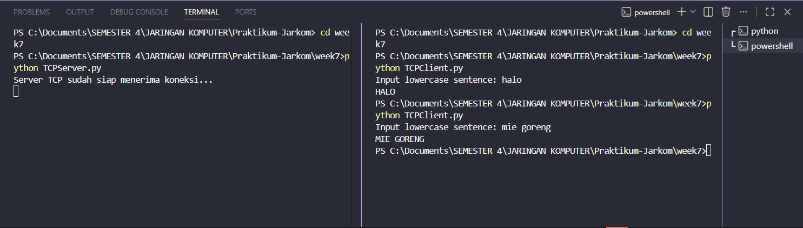

# Laporan Praktikum Jaringan Komputer - Modul 7
## Socket Programming: UDP dan TCP

> **Semester Genap 2025/2026 | Fakultas Informatika | Universitas Telkom**

---

### Identitas Praktikan

| Keterangan | Informasi |
|------------|-----------|
| **Nama Lengkap** | Restu Fadilah Al Fatah |
| **NIM** | 103072400081 |
| **Kelas** | IF-04-01 |

---

## 1. Tujuan Praktikum

| No | Tujuan                                           | Penjelasan                                                                                                          |
| -- | ------------------------------------------------ | ------------------------------------------------------------------------------------------------------------------- |
| 1  | Merancang aplikasi client-server menggunakan UDP | Memahami implementasi komunikasi jaringan berbasis UDP yang bekerja tanpa perlu membangun koneksi terlebih dahulu.  |
| 2  | Merancang aplikasi client-server menggunakan TCP | Mempelajari cara kerja komunikasi TCP yang mengharuskan adanya pembentukan koneksi antara client dan server.        |
| 3  | Membandingkan karakteristik UDP dan TCP          | Mengetahui perbedaan fitur, keunggulan, kelemahan, serta penerapan kedua protokol pada berbagai kebutuhan jaringan. |
| 4  | Mengkaji proses pertukaran data pada jaringan    | Mengamati aliran data dan mekanisme komunikasi yang terjadi antara client dan server selama proses berlangsung.     |


---

## 2. Dasar Teori

### 2.1 Konsep Socket Programming

| Istilah     | Definisi                                                                                                               |
| ----------- | ---------------------------------------------------------------------------------------------------------------------- |
| **Socket**  | Mekanisme atau titik akhir komunikasi yang memungkinkan dua aplikasi saling bertukar data melalui jaringan.            |
| **Client**  | Aplikasi yang berperan sebagai pengirim permintaan dan memulai proses komunikasi dengan server.                        |
| **Server**  | Aplikasi yang bertugas menunggu koneksi, menerima permintaan, serta memberikan layanan kepada client.                  |
| **Binding** | Proses mengaitkan socket dengan alamat IP dan port tertentu agar dapat digunakan dalam komunikasi jaringan.            |
| **Listen**  | Keadaan ketika server aktif menunggu permintaan koneksi yang datang dari client.                                       |
| **Accept**  | Tahapan di mana server menerima koneksi yang masuk dan membuat socket khusus untuk menangani komunikasi dengan client. |
| **Connect** | Proses yang dilakukan client untuk menjalin koneksi dengan server sebelum melakukan pertukaran data.                   |


### 2.2 Perbandingan UDP dan TCP

| Karakteristik           | UDP                                                     | TCP                                                          |
| ----------------------- | ------------------------------------------------------- | ------------------------------------------------------------ |
| **Jenis Komunikasi**    | Tidak memerlukan koneksi (*connectionless*)             | Memerlukan koneksi terlebih dahulu (*connection-oriented*)   |
| **Pembentukan Koneksi** | Data dapat langsung dikirim tanpa handshake             | Harus melalui proses *3-way handshake* sebelum bertukar data |
| **Keandalan**           | Tidak menjamin data terkirim atau diterima dengan benar | Menjamin keandalan pengiriman melalui ACK dan retransmisi    |
| **Pengurutan Data**     | Paket dapat tiba dalam urutan yang berbeda              | Data diterima sesuai urutan pengirimannya                    |
| **Ukuran Header**       | Lebih kecil, hanya 8 byte                               | Lebih besar, minimal 20 byte                                 |
| **Kecepatan Transfer**  | Lebih cepat karena overhead yang rendah                 | Relatif lebih lambat akibat mekanisme kontrol tambahan       |
| **Kontrol Aliran Data** | Tidak memiliki fitur flow control                       | Menyediakan flow control dengan mekanisme window             |
| **Bidang Penggunaan**   | Cocok untuk DNS, VoIP, streaming, dan game online       | Umum digunakan pada web, email, dan transfer file            |
                     |


---

## 3. Praktikum UDP Socket

### 3.1 Kode Program UDP Server

**File:** `UDPServer.py`

```python
from socket import *

serverPort = 12000

serverSocket = socket(AF_INET, SOCK_DGRAM)

serverSocket.bind(('', serverPort))

print("Server UDP sudah siap menerima pesan...")

while True:
    message, clientAddress = serverSocket.recvfrom(2048)
    modifiedMessage = message.decode().upper()
    serverSocket.sendto(modifiedMessage.encode(), clientAddress)
```

**Penjelasan:**
- Server membuat socket UDP dengan `SOCK_DGRAM`
- Bind ke port 12000
- Looping terus menerus untuk menerima pesan dari client
- Mengubah pesan menjadi uppercase dan mengirim balik

---

### 3.2 Kode Program UDP Client

**File:** `UDPClient.py`

```python
from socket import *

serverName = 'localhost'
serverPort = 12000

clientSocket = socket(AF_INET, SOCK_DGRAM)
message = input('Input lowercase sentence: ')
clientSocket.sendto(message.encode(), (serverName, serverPort))

modifiedMessage, serverAddress = clientSocket.recvfrom(2048)
print(modifiedMessage.decode())

clientSocket.close()
```

**Penjelasan:**
- Client membuat socket UDP (tidak perlu bind port)
- Langsung kirim pesan ke server dengan `sendto()`
- Terima response dengan `recvfrom()`
- Tidak perlu `connect()` karena UDP connectionless

---

### 3.3 Hasil Eksekusi UDP

**Langkah Testing:**
1. Buka terminal 1 → jalankan server
2. Buka terminal 2 → jalankan client
3. Input pesan dan lihat hasilnya

**Terminal - Output UDP:**


Server berjalan dan menunggu pesan dari client.
Client mengirim pesan dan menerima response dari server.

**Hasil:**
- Input: `halo`
- Output dari server: `HALO`
- Pesan berhasil dikonversi ke uppercase

---

## 4. Praktikum TCP Socket

### 4.1 Kode Program TCP Server

**File:** `TCPServer.py`

```python
from socket import *

serverPort = 12000

serverSocket = socket(AF_INET, SOCK_STREAM)
serverSocket.bind(('', serverPort))
serverSocket.listen(1)

print("Server TCP sudah siap menerima koneksi...")

while True:
    connectionSocket, addr = serverSocket.accept()
    sentence = connectionSocket.recv(2048).decode()
    capitalizedSentence = sentence.upper()
    connectionSocket.send(capitalizedSentence.encode())
    connectionSocket.close()
```

**Penjelasan:**
- Server membuat socket TCP dengan `SOCK_STREAM`
- `listen(1)` → siap menerima koneksi (max 1 antrian)
- `accept()` → terima koneksi dari client, buat `connectionSocket` baru
- Setelah selesai, `connectionSocket.close()` (serverSocket tetap terbuka)

---

### 7.3.2 Kode Program TCP Client

**File:** `TCPClient.py`

```python
from socket import *

serverName = 'localhost'
serverPort = 12000

clientSocket = socket(AF_INET, SOCK_STREAM)
clientSocket.connect((serverName, serverPort))

sentence = input('Input lowercase sentence: ')
clientSocket.send(sentence.encode())

modifiedSentence = clientSocket.recv(2048)

print(modifiedSentence.decode())

clientSocket.close()
```

**Penjelasan:**
- Client membuat socket TCP
- `connect()` → inisiasi koneksi (3-way handshake)
- Kirim data dengan `send()` (tidak perlu alamat tujuan)
- Terima response dengan `recv()`

---

### 7.3.3 Hasil Eksekusi TCP

**Langkah Testing:**
1. Buka terminal 1 → jalankan TCP server
2. Buka terminal 2 → jalankan TCP client
3. Input kalimat dan lihat hasilnya

**Terminal - OUTPUT TCP:**


Server siap menerima koneksi dan memproses pesan dari client.
Client terhubung ke server, mengirim pesan, dan menerima response.

**Hasil:**
- Input: `halo`
- Output dari server: `HALO`
- Koneksi TCP established sebelum transfer data

---

## 7.4 Perbandingan UDP vs TCP (Hasil Praktikum)

### 7.4.1 Perbedaan Implementasi

| Aspek                              | UDP                                                                  | TCP                                                                                                |
| ---------------------------------- | -------------------------------------------------------------------- | -------------------------------------------------------------------------------------------------- |
| **Tipe Socket**                    | Menggunakan `SOCK_DGRAM`                                             | Menggunakan `SOCK_STREAM`                                                                          |
| **Mekanisme Koneksi**              | Tidak memerlukan fungsi `connect()` karena bersifat connectionless   | Memerlukan fungsi `connect()` untuk membangun koneksi dengan server                                |
| **Socket pada Server**             | Satu socket dapat melayani seluruh client                            | Menggunakan socket utama untuk menerima koneksi dan socket baru untuk setiap client yang terhubung |
| **Pengiriman dan Penerimaan Data** | Menggunakan fungsi `sendto()` dan `recvfrom()`                       | Menggunakan fungsi `send()` dan `recv()`                                                           |
| **Pengelolaan Alamat**             | Alamat tujuan atau pengirim harus dicantumkan pada setiap komunikasi | Alamat tidak perlu ditentukan lagi setelah koneksi berhasil dibuat                                 |


---

### 7.4.2 Perbedaan Hasil Eksekusi

| Karakteristik | UDP | TCP |
|--------------|-----|-----|
| **Kecepatan** | Lebih cepat (langsung kirim) | Ada delay handshake |
| **Server** | Handle multiple client simultan | Handle 1 client per waktu |
| **Client** | Bisa kirim berkali-kali | Kirim 1x, koneksi selesai |
| **Reliability** | Tidak ada jaminan | Data terjamin sampai |

---

## 7.5 Analisis Praktikum

### 7.5.1 UDP Socket

**Hasil Pengamatan:**
- Server bisa menerima pesan dari berbagai client
- Tidak ada proses koneksi yang terlihat
- Pesan langsung dikirim dan diterima
- Tidak ada konfirmasi delivery

**Keunggulan UDP:**
- Implementasi sederhana
- Tidak ada overhead koneksi
- Cocok untuk aplikasi real-time

**Keterbatasan:**
- Tidak ada jaminan pesan sampai
- Tidak ada urutan data
- Tidak ada retransmisi

---

### 7.5.2 TCP Socket

**Hasil Pengamatan:**
- Ada proses `connect()` sebelum kirim data
- Server membuat socket khusus untuk setiap client
- Data terjamin sampai dan berurutan
- Koneksi ditutup setelah selesai

**Keunggulan TCP:**
- Reliable delivery
- Data terurut
- Flow control & congestion control

**Keterbatasan:**
- Overhead lebih besar
- Ada delay handshake
- Lebih kompleks

---

## 7.6 Testing Tambahan

### 7.6.1 Multiple Clients (UDP)

**Test:** Jalankan beberapa client secara bersamaan

**Hasil:**
- UDP server bisa handle multiple clients
- Semua client menggunakan socket yang sama
- Pesan diproses satu per satu dalam loop

---

### 7.6.2 Multiple Clients (TCP)

**Test:** Coba connect beberapa client

**Hasil:**
- TCP server handle client secara sequential
- Client kedua harus tunggu client pertama selesai
- Setiap client dapat `connectionSocket` terpisah

**Catatan:** Untuk handle concurrent clients, perlu implementasi threading.

---

## 7.7 Kesimpulan

| Aspek | UDP Socket | TCP Socket |
|-------|------------|------------|
| **Implementasi** | Lebih sederhana | Lebih kompleks tapi reliable |
| **Koneksi** | Connectionless (tidak perlu handshake) | Connection-oriented (perlu 3-way handshake) |
| **Delivery** | Tidak ada jaminan delivery | Data terjamin sampai |
| **Urutan Data** | Tidak dijamin | Terjamin berurutan |
| **Prioritas** | Mengutamakan kecepatan | Mengutamakan keandalan |
| **Metode Kirim** | `sendto()` | `send()` |
| **Metode Terima** | `recvfrom()` | `recv()` |
| **Socket Server** | 1 socket untuk semua client | 2 socket (`serverSocket` + `connectionSocket`) |
| **Fungsi Wajib** | Tidak perlu `connect()`/`listen()`/`accept()` | Perlu `connect()`/`listen()`/`accept()` |
| **Use Case** | DNS, Streaming, VoIP, Gaming | Web, Email, File Transfer |
| **Nilai Utama** | **Socket programming memberikan kontrol penuh terhadap komunikasi jaringan di application layer** | **Socket programming memberikan kontrol penuh terhadap komunikasi jaringan di application layer** |


---